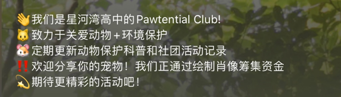

<h1 align=center>Pawtential</h1>

Pawtential is a charity club focused on stray adoption and environment protection

  

This is going to be the home page of a pet-adoption charity organization which compiles information of stray pets and posts them here to look for potential owners.
Advocates adoption > purchase to minimize the effect of inhuamne treatment of animals in breeding instutions.

### Made by CS Club at SSBS

## 🔑Key Features to be added

- 🎨 Warm theme color and friendly font
- 👥 Multi-Author Support with admin login and uploading
- 📚 Admins' Page
- 🔍 Search Functionality
- 🏷️ Tags and Categories Support
- 🔗 Post suggestions
- ⚡ Speed
- 📬 Contact Form Support
- 🌅 Support OG Image
- ✍️ Write and Update Content in Markdown / MDX
- 📚 MDX Components Auto Import
- 📝 Includes Draft Pages and Posts
- 🚀 Built with Tailwind CSS Framework! Yay!
- 📱 Fully Responsive on Desktops, Tablets, and Smartphones
- 🔍 SEO Friendly

## How to use and deploy:
0: Make sure that you have pnpm and node.js installed in the RIGHT way!
1: Open terminal and type 'pnpm install dependencies'
2: Also in the terminal: 'pnpm dev'
3: View the webpage at port localhost:1234

<!-- licence -->
## 📄License

Copyright (c) 2024 - Present, Designed & Developed by Claire Zhao, George Shi

**Code License:** Released under the [MIT] license.

**Image license:** The images are only for demonstration purposes. They have their license, we don't have permission to share those images.
